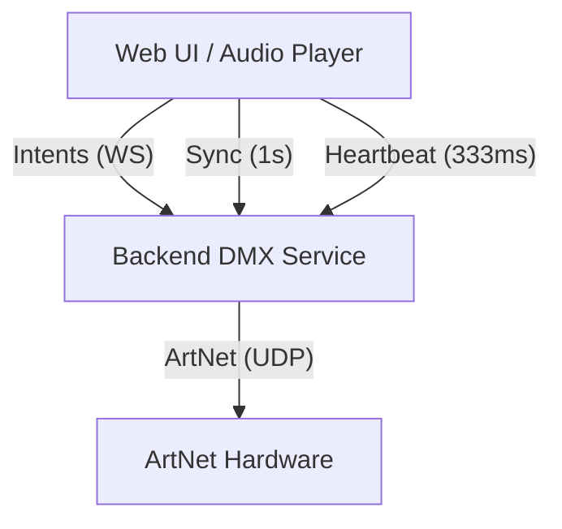
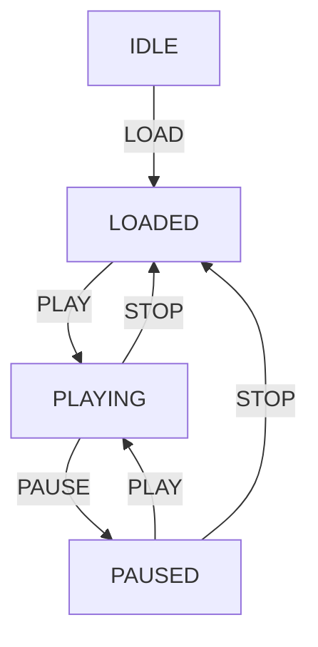

# Design: DMX Player Architecture

## 1. System Overview



## 2. Intent Protocol (Typed JSON)

All communication occurs via WebSocket. Every message follows this schema:

### 2.1 Client -> Server Intents

```typescript
interface Intent<T = any> {
  type: 'PLAY' | 'PAUSE' | 'STOP' | 'SEEK' | 'SYNC' | 'LOAD' | 'LIST_ASSETS' | 'HEARTBEAT';
  payload: T;
  timestamp: number; // UI Master Time in ms
}

// Payload for 'LOAD'
type LoadPayload = { songFile: string; dmxFile: string };
```

### 2.2 Server -> Client Events

```typescript
interface ServerEvent<T = any> {
  type: 'ACK' | 'STATE_CHANGE' | 'ASSETS_MANIFEST' | 'WARNING' | 'ERROR';
  payload: T;
  timestamp: number; // Server's internal precision timestamp
}
```

## 3. Synchronization Strategy: The "Steering" Algorithm

Instead of hard-resetting the backend time every 10 seconds (which causes visible lighting glitches), the backend implements a **Variable Speed Oscillator**.

1.  **UI Report**: UI sends `{ type: 'SYNC', payload: { currentTime: 10500 } }` every **1 second**.
2.  **Drift Calculation**: Backend compares its internal `playbackPosition` with `currentTime`.
3.  **Correction**:
    - If BE is behind: Increase playback speed by 0.5% until caught up.
    - If BE is ahead: Decrease playback speed by 0.5%.
    - If Delta > 500ms: Perform a hard "Seek" jump.

## 4. DMX Scheduler & State Machine

The scheduler runs in a dedicated Node.js `worker_thread` following a strict behavior model.

### 4.1 State Machine Rules

- **SEEK**: Jumps to target frame but preserves current state (does not force playback).
- **STOP**: Resets playhead to `0:00`, triggers a Blackout frame burst, and rests in `LOADED` (does not clear memory).
- **LOCKING**: `LOAD` is completely rejected/locked while in `PLAYING` to prevent accidental show drops.

### 4.2 Scheduler Operation

- **Preloading**: To eliminate I/O jitter, the `DmxFileLoader` reads the entire `.dmx` file into a `SharedArrayBuffer` during the `LOAD` phase.
- **Memory Limit**: Shows are capped at **15 minutes** (45,000 frames). At 516 bytes per record, the maximum `SharedArrayBuffer` size is ~23.3 MB.
- **Worker Access**: The worker thread maps the SAB and uses the `playbackPosition` provided by the steering logic to index the pre-buffered frames.
- **ArtNet Target**: Unicast to `DMX_NODE_IP` (192.168.10.221). 
  - Routing is configurable via `ARTNET_NET`, `ARTNET_SUBNET`, and `ARTNET_UNIVERSE`.
- **Blackout Burst**: When transitioning to `STOPPED` or `PAUSED`, the worker sends a burst of 5 identical "all-zero" packets at 2ms intervals before stopping the transmission loop entirely.
- **Clock Source**: `process.hrtime.bigint()` for sub-millisecond precision.
- **Logic**: The worker thread performs a "precise yield" loop. It calculates the time until the next frame and uses a combination of `Atomics.wait()` (for power efficiency) and a short "busy-wait" for the final 1ms to hit the exact nanosecond target.

### Timing Budget (per 20ms frame)
- **File I/O (Pre-buffered)**: 0.1ms
- **Packet Construction**: 0.05ms
- **UDP Transmission**: 0.2ms
- **Remaining Jitter Margin**: ~9.6ms

## 5. DMX File Specification (.dmx)

The file uses a Little-Endian binary format composed of a fixed 32-byte header followed by sequential frame records.

### 5.1 Global Header (32 Bytes)
| Offset | Size | Type   | Description |
| :---   | :--- | :---   | :--- |
| 0      | 4    | char   | Magic Number: `DMXP` |
| 4      | 2    | uint16 | Version: `1` |
| 6      | 2    | uint16 | Universe Count: `1` |
| 8      | 4    | uint32 | Total Frames in file |
| 12     | 4    | uint32 | Expected Frame Rate (e.g., `50` for 20ms intervals) |
| 16     | 16   | -      | Reserved for future metadata (Padding) |

### 5.2 Frame Record Structure
Each frame record is exactly **516 bytes**.

| Field     | Size | Type   | Description |
| :---      | :--- | :---   | :--- |
| Timestamp | 4    | uint32 | Milliseconds from show start |
| DMX Data  | 512  | uint8  | Raw DMX channel values (0-255) |

### 5.3 O(1) Seek Calculation
To jump to a specific frame index `n`:
`ByteOffset = 32 + (n * 516)`

## 6. Failure Modes

| Failure | Action |
| :--- | :--- |
| WS Disconnect | 1-second timeout (missing 3 Heartbeats). Immediately send all zeros (Blackout) and transition to PAUSED/LOADED. |
| STOP/PAUSE | Send 5-frame Blackout burst then enter silence. |
| Audio Stall | UI sends PAUSE intent; backend stops scheduler immediately. |
| Buffer Underrun | Backend repeats last valid frame and sends WARNING to UI. |

## 7. UI Components

### 7.1 Layout Structure
The UI is divided into a **Fixed Header** (Controls) and a **Content Lane** (Data).

**Header (Three Rows):**
1. **Top Row**: 
   - `Song Name`: Clickable label that opens a dropdown of available audio files from `/data/songs`.
   - `Show Name`: Clickable label that filters available `.dmx` files based on the selected `Song Name`.
     - **No Show Logic**: If the selected song has no matching `.dmx` files, the label displays a warning: "*no shows available*". The song can still be loaded and played, but DMX output remains silent.
2. **Middle Row**: Full-width **wavesurfer.js** container showing the audio waveform.
3. **Bottom Row**:
   - `Controls`: [Stop] (Blackout + Reset to 0), [Play/Pause Toggle].
   - `Time Display`: High-visibility clock in `0:00.00` format.

**Content Lane (Three Columns):**
- Three equal-width columns as placeholders for future DMX monitoring, logs, or visualization.

### 7.2 Styling & Theme
- **Palette**: Pure Dark Mode; Accent: `#9000dd`.
- **Geometry**: `border-radius: 0` (Hard edges).
- **Density**: Compact padding (`max 0.5em`).
- **Typography**: Monospaced font for the Big Time Display to prevent character jumping during playback.

## 8. Infrastructure & Deployment

### 8.1 Containerization
The application is strictly containerized using Docker. The development environment mirrors production to prevent "works on my machine" timing discrepancies.

### 8.2 Networking
- **Web UI/API**: Port 3000 (TCP) is exposed to the host to allow control from tablets/phones on the local network.
- **ArtNet**: Port 6454 (UDP) must be accessible. For high-end performance, the container should ideally use `network_mode: host` on Linux to minimize UDP overhead, but port mapping is used for standard cross-platform compatibility.
